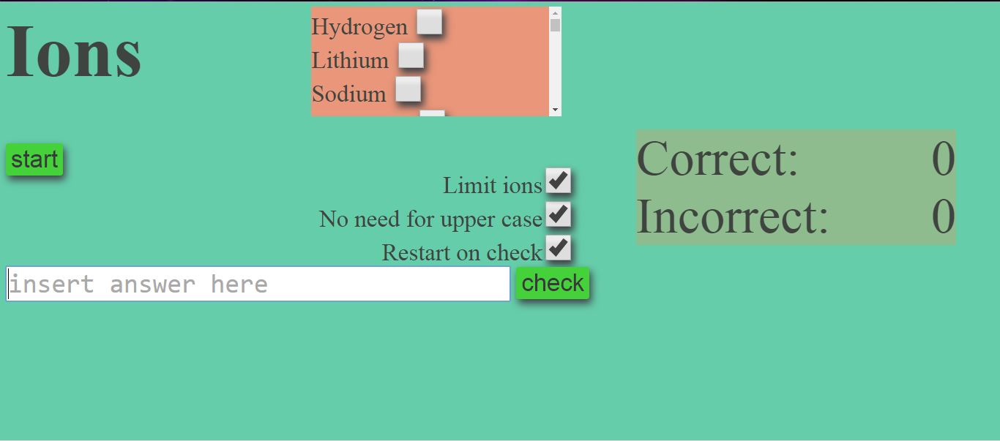

# Ion-tester #
Made to help learning ions.
## A note on learning ##
This project does not do what it was supposed to.
### How the brain chooses what to store more
- Things that happened first
- Things that were more recent
- Suprising things
- Things with a suprising impact
- Repitition (This is what was attempted in this project)
You can read more [here](https://www.quora.com/How-does-the-human-brain-decide-which-memories-to-store/answer/Paul-King-2?srid=JiCC)

A problem with this project is that it does more harm than good. If you wish to learn the ions, do it naturally - by doing a lot of problems. The ions that turn up more frequently, you will remember; but the ones that turn up less, you don't need to.

## Ion name tester ##

* "Limit ions": choose which ions you want to learn
* "No need for upper case": toggle case sensitivity
* "Restart on check": after pressing checking, A new round will start
* "start": start a new round
* "check": check if you have answered correctly. Same as pressing "enter" on your keyboard.

## Ion formula tester ##

This doesn't have any input, and instead works as flash cards.

## How can I use this? ##
[Formula tester link](https://htmlpreview.github.io/?https://github.com/MiND951/ion-tester/blob/master/compiled/ion_tester_small.html)

[Name tester link](https://htmlpreview.github.io/?https://github.com/MiND951/ion-tester/blob/master/compiled/ion_name_test.html)
